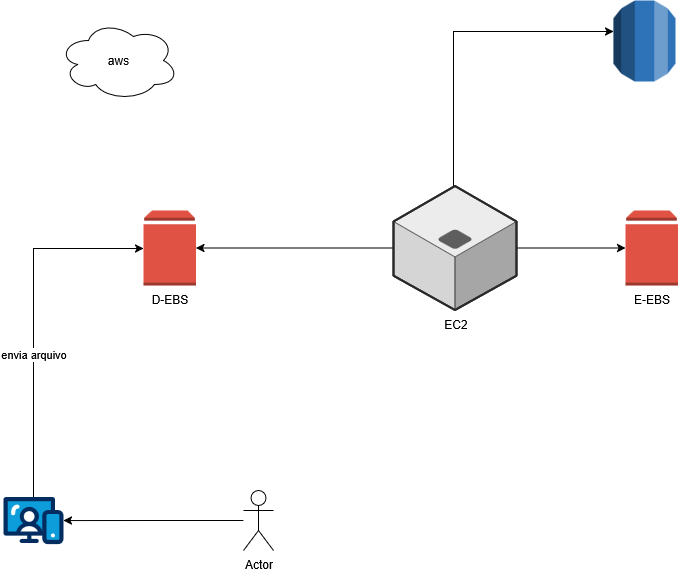

# Arquitetura Simplificada em AWS

Este repositório contém uma representação gráfica simplificada de uma arquitetura baseada na AWS. O diagrama foi criado para ilustrar o fluxo de dados entre componentes essenciais de um sistema que recebe, processa e armazena arquivos enviados por usuários.

---

## 📌 Objetivo

Demonstrar o fluxo de uma aplicação que recebe arquivos via interface do usuário, processa-os em uma instância na AWS e armazena os resultados em um banco de dados.

---

## 🧩 Componentes da Arquitetura

### 1. 👤 Usuário
- Inicia o processo através do envio de um arquivo por uma interface web ou aplicativo.

### 2. 📤 Envio de Arquivo
- O arquivo é enviado para uma API ou serviço intermediário.

### 3. 🧱 Load Balancer (opcional)
- Distribui as requisições entre múltiplas instâncias EC2 (se aplicável).

### 4. 📦 Instância EC2
- Responsável por processar o arquivo enviado.
- Pode incluir lógica de negócio, validações e transformações de dados.

### 5. 🗃️ Banco de Dados (RDS)
- Armazena os dados processados.
- Pode ser um banco relacional como PostgreSQL, MySQL, etc.

### 6. ☁️ AWS S3 (não mostrado diretamente no diagrama)
- Alternativamente, arquivos podem ser armazenados no S3, antes ou depois do processamento.

---

## 🔄 Fluxo de Dados

1. O usuário envia um arquivo.
2. O arquivo chega a uma instância EC2 (via API ou Load Balancer).
3. A EC2 processa o arquivo.
4. O resultado do processamento é armazenado no banco de dados RDS.

---

## 🧰 Tecnologias Utilizadas

- **AWS EC2** – Instâncias de computação para processamento.
- **AWS RDS** – Banco de dados relacional.
- **AWS S3** (opcional) – Armazenamento de arquivos.
- **Load Balancer** (opcional) – Distribuição de carga.
- **draw.io** – Ferramenta de criação do diagrama.

---

## 📎 Diagrama

---

## 🚀 Possíveis Melhorias

- Adicionar autenticação/autorização para os uploads.
- Utilizar Lambda e S3 para processamento sem servidor.
- Monitoramento com CloudWatch.
- Armazenamento de arquivos em S3 e metadados no RDS.

---

## 📄 Licença

Este projeto é apenas para fins educacionais e de demonstração. Licenciamento pode ser adicionado conforme necessário.
